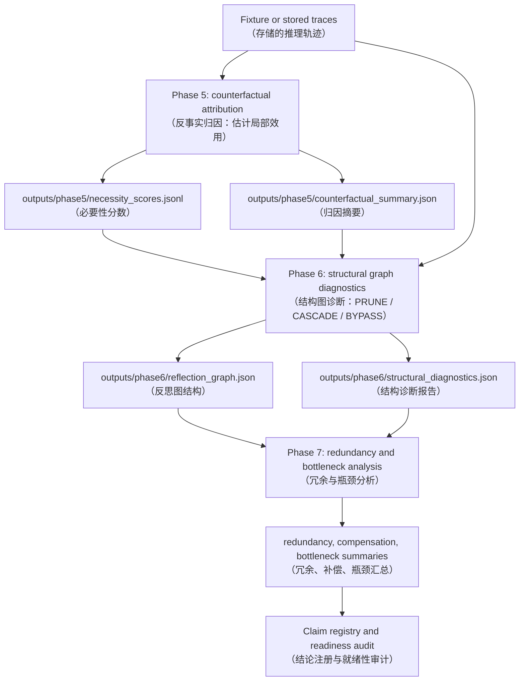

# Functional Metacognitive Attribution

[](https://github.com/TigerUnderTheMoon/CF/actions)
[](https://www.python.org/)
[](#citation)
[](https://codecov.io/gh/TigerUnderTheMoon/CF)

FMA 是一个用于评估反思型智能体推理轨迹中局部效用与结构必要性的诊断框架。

Functional Metacognitive Attribution (FMA, 功能性元认知归因) 研究推理轨迹（reasoning traces，智能体逐步思考的可观测文本序列）中的可观测反思步骤。它提出一个有界问题：哪些反思步骤在局部看起来有用，以及在图级别干预（graph-level interventions，对推理结构进行可控修改）之后，哪些步骤在结构上仍然是必需的？

## Core Features

- **Counterfactual attribution（反事实归因）**: Phase 5 从存储的推理轨迹和结构保留消融（structure-preserving ablations，保持文本长度和位置不变的干预）中估计局部归因分数 `attribution_score`（局部反事实效用分数）。
- **Structural diagnostics（结构诊断）**: Phase 6 在三种图干预模式下比较局部归因与结构必要性——PRUNE（单节点移除，仅删除一个节点）、CASCADE（节点及其后继移除，删除节点及其所有下游依赖）和 BYPASS（移除并重连下游结构，跳过节点并将上游直接连接到下游）。
- **Redundancy and bottleneck analysis（冗余与瓶颈分析）**: Phase 7 总结瓶颈（bottleneck nodes，高局部效用且高结构必要性的稀缺节点）、分布式冗余和补偿路径，但不声称实现了真正的因果识别（true causal identification）。
- **Claim-safe pilot governance（审计边界治理）**: 真实任务和下游路线保持在 `PILOT_BLOCKED`（试点证据存在但升级门限未满足）状态，除非其预注册的产物通过规定的门限。

## Quick Start

```bash
# 1. 安装依赖（包含可编辑模式的 FMA 包）
pip install -e .

# 2. 运行测试套件验证环境
pytest -q

# 3. 运行 Phase 5：反事实归因（从存储轨迹计算局部效用）
fma run-phase5 --config configs/demo.yaml

# 4. 运行 Phase 6：结构图诊断（比较局部效用与结构必要性）
fma run-phase6 --input outputs/phase5/
```

Demo 会将教程产物写入 `outputs/phase5/` 和 `outputs/phase6/`。它不会覆盖历史顶级证据文件。

如需快速浏览代码示例，请查看 [`examples/`](examples/) 目录下的 Jupyter Notebook：

- [`01_counterfactual_attribution.ipynb`](examples/01_counterfactual_attribution.ipynb) — 加载 fixture traces 并展示 `attribution_score` 的计算过程。
- [`02_graph_diagnostics.ipynb`](examples/02_graph_diagnostics.ipynb) — 构建 NetworkX 图，执行 PRUNE / CASCADE / BYPASS 三种干预，并可视化瓶颈节点。
- [`03_interpreting_audit.ipynb`](examples/03_interpreting_audit.ipynb) — 连接 `audit.db`，查询 v2.1 的失败事件并可视化成本分布。

## Architecture



数据流说明：

1. **Phase 5** 读取存储的推理轨迹，通过单步消融（single-step ablation，逐一移除反思步骤并观测效用变化）计算 `attribution_score` 和 `necessity`（局部必要性，即原效用与消融后效用的差异，Delta-U）。
2. **Phase 6** 将轨迹构建为有向无环图（DAG），然后执行三种干预模式——PRUNE（单节点移除）、CASCADE（节点及其后继移除）、BYPASS（移除并重连下游结构）——以估计每个节点的拓扑敏感必要性（topology-sensitive necessity）。
3. **Phase 7** 跨图聚合结果，识别高归因但低必要性的冗余节点，以及高归因且高必要性的瓶颈节点，最终写入审计和可视化产物。

## Repository Layout

| Path | Purpose |
|---|---|
| `src/fma/` | 可安装的 Python 包，包含归因、图诊断、干预、真实任务试点工具和可视化。 |
| `scripts/` | Phase 5–7 和受保护试点路线的可复现命令行运行器。 |
| `configs/` | YAML 实验和演示配置。 |
| `data/traces/` | 可复现诊断使用的存储合成轨迹输入。 |
| `outputs/` | 生成的证据产物，包括历史 Phase 5–7 报告和受保护的试点审计。 |
| `examples/` | 归因、图诊断和审计解读的 Notebook 逐步教程。 |
| `docs/adr/` | 架构决策记录（ADR, Architecture Decision Records），解释关键方法论选择。 |
| `paper/` | 手稿文本、结论注册、就绪性审计和提交边界文档。 |
| `tests/` | 确定性的单元测试和契约测试。 |

## Benchmark

性能基准在 **8 vCPU / 32 GB RAM** 环境下测得。以下时间为包含进程池启动开销的保守估计；若使用轻量级纯 Python 求值器，实际耗时会更短。若将 `evaluator` 替换为模型推理（如 LLM 调用），时间将随单次推理延迟线性增长。

| Phase | 规模 | 并行后端 | 预期耗时 | 说明 |
|---|---|---|---|---|
| **Phase 5** | 800 traces（≈14,400 ablation rows） | `joblib.Parallel(backend="loky")` 或 `threading` | **2 – 4 分钟** | 6 种 ablation 策略（ATTRIBUTION_TOP_K / BOTTOM_K / RANDOM_K / POSITIONAL_FIRST_K / POSITIONAL_LAST_K / CATEGORY_MATCHED_RANDOM）按 trace chunk（chunk_size=100）并行执行；进度条由 `tqdm` 提供。 |
| **Phase 6** | 800 graphs × 3 种干预模式 | `concurrent.futures.ProcessPoolExecutor` | **1 – 2 分钟** | PRUNE / CASCADE / BYPASS 三种移除模式对图结构做深拷贝后分发到子进程；每个 worker 在计算前重置与父进程相同的随机种子，保证确定性。 |
| **Phase 7** | 800 traces 的冗余与瓶颈汇总 | 串行或局部多线程 | **30 秒 – 1 分钟** | 瓶颈检测、冗余密度和补偿分析计算量较小，主要耗时在 I/O 与可视化（matplotlib 绘图）。 |

### 大规模扩展（80,000 traces）

对于 80,000 条轨迹的规模，请使用 `IncrementalAttributionEngine`（`fma.attribution.engine`）：

- **分块**：默认 `chunk_size=100`，自动将中间结果写入 `outputs/phase5/chunks/chunk_{i:05d}.jsonl`。
- **断点续算**：设置 `resume=True`，已完成的 chunk 会从磁盘直接读取，跳过重复计算。
- **Checkpoint**：每完成一个 chunk 后更新 `outputs/phase5/chunks/checkpoint.json`，记录 `completed_chunks` 与 `total_chunks`。
- **确定性**：主进程与每个 worker 均在并行计算前调用相同的 `random.seed` 和 `np.random.seed`，因此并行结果与串行结果逐行一致。

### 运行基准测试

```bash
# 使用自定义装饰器（memory_profiler + tracemalloc）
python -c "
from fma.utils.benchmark import benchmark_function
from fma.attribution.engine import ParallelAttributionEngine

engine = ParallelAttributionEngine(seed=42, chunk_size=100, n_jobs=-1)
# ... 准备 traces 和 annotations ...
result, bm = benchmark_function('phase5_800_traces', engine.run_single_step_ablations, traces, annotations)
print(bm)
"

# 可选：使用 pyperf 进行多轮统计计时（若已安装 pyperf）
python -c "
from fma.utils.benchmark import pyperf_benchmark_function
# pyperf_benchmark_function 会执行多轮并记录 mean / stdev
"
```

产物默认写入 `outputs/benchmarks/phase5_benchmark.json`，格式如下：

```json
{
  "schema_version": "phase-benchmark-v1",
  "generated_at_utc": "2026-06-06T12:00:00",
  "benchmarks": [
    {
      "name": "phase5_800_traces",
      "elapsed_seconds": 142.3,
      "peak_memory_mb": 512.0,
      "measured_with": "memory_profiler",
      "timestamp_utc": "2026-06-06T12:00:00",
      "metadata": {}
    }
  ]
}
```

## DVC Data Management

This repository uses [DVC](https://dvc.org/) (Data Version Control) to manage large artifacts in `data/` and `outputs/`, keeping the Git repository lightweight while preserving full reproducibility.

### Quick commands

```bash
# Pull tracked data and outputs from remote storage
dvc pull

# Re-run the full pipeline (phase5 → phase6 → phase7 → figures → metrics)
dvc repro

# Re-run only a specific stage and its downstream dependencies
dvc repro figures

# Show aggregated metrics
dvc metrics show

# Push local data / outputs to the configured remote
dvc push
```

### Pipeline stages

| Stage | Input | Output | Description |
|---|---|---|---|
| `phase5` | `data/synthetic_traces.jsonl` | `outputs/phase5/` | Counterfactual attribution & necessity scores |
| `phase6` | `outputs/phase5/` | `outputs/phase6/` | Structural graph diagnostics (PRUNE / CASCADE / BYPASS) |
| `phase7` | `outputs/phase6/` | `outputs/phase7/` | Redundancy, bottleneck & compensation analysis |
| `figures` | `outputs/phase7/` | `outputs/figures/` | Aggregated visualization artifacts |
| `metrics` | `outputs/phase{5,6,7}/` | `outputs/metrics.json` | Aggregated metrics file for `dvc metrics show` |

### Historical artifacts

Legacy outputs (failed pilots, v2 / v2.2 holdouts, and earlier top-level JSON/JSONL files) have been archived to `outputs/archive/` and are tracked by DVC via `outputs/archive.dvc`. Core Phase 5–7 directories and `outputs/figures/` are managed by the `dvc.yaml` pipeline.

### Remote storage configuration

The default remote is a local filesystem path:

```bash
dvc remote add -d local /path/to/dvc-storage
```

Cloud remote templates are provided in `.dvc/config` (commented). Uncomment and fill in the relevant block for Google Drive or S3, then run:

```bash
dvc remote modify --default s3  # or gdrive
dvc push
```

### Cleaning up legacy outputs

Use the built-in CLI to archive failed pilots while preserving core Phase 5–7 directories:

```bash
fma clean-outputs --keep-core --archive-failed
```

Add `--no-archive-legacy` if you only want to archive the failed pilot routes without moving other top-level files.

## Current Evidence Boundary

已完成的诊断证据支持“局部效用（local utility）”与“稀疏结构必要性（sparse structural necessity）”之间的区分。它**不**建立下游 PRM/filtering 改进，其中 PRM 指过程奖励模型（Process Reward Model）。当前的真实任务和下游路线受限于 `paper/claim_registry.md` 中的结论注册和 `paper/submission_readiness_audit.md` 中的就绪性审计。

## Citation

```bibtex
@misc{fma2026,
  title        = {Functional Metacognitive Attribution},
  author       = {Anonymous},
  year         = {2026},
  note         = {Diagnostic framework for local utility and structural necessity in reflective reasoning traces},
  howpublished = {\url{https://github.com/TigerUnderTheMoon/CF}}
}
```
