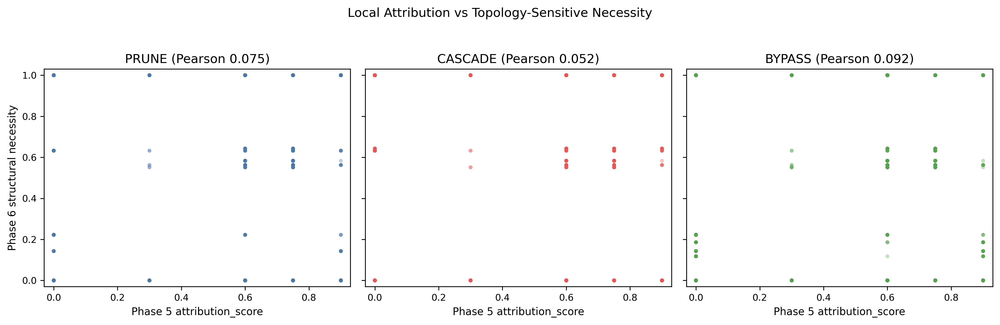
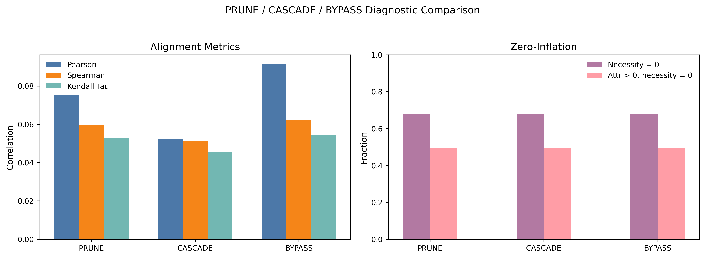
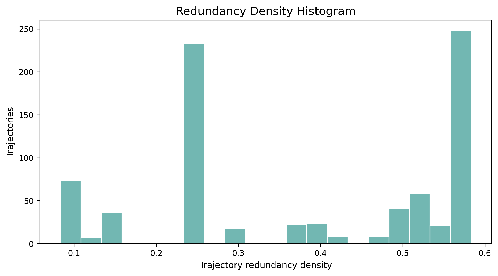
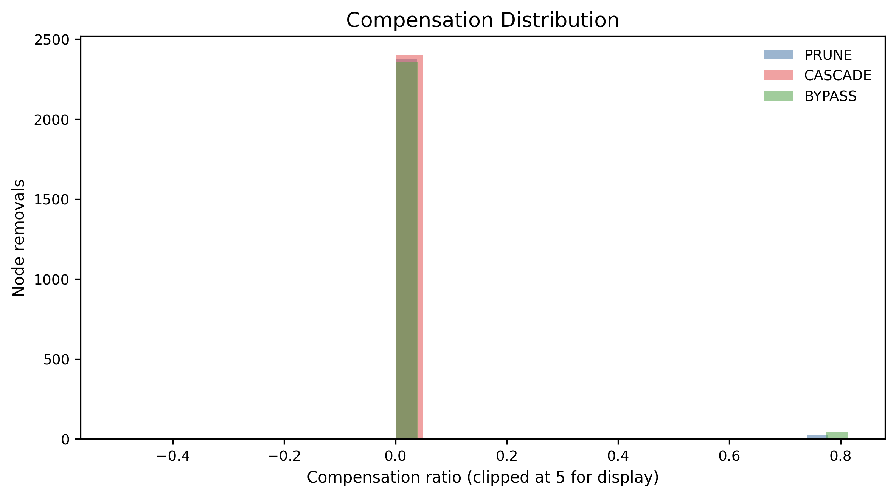
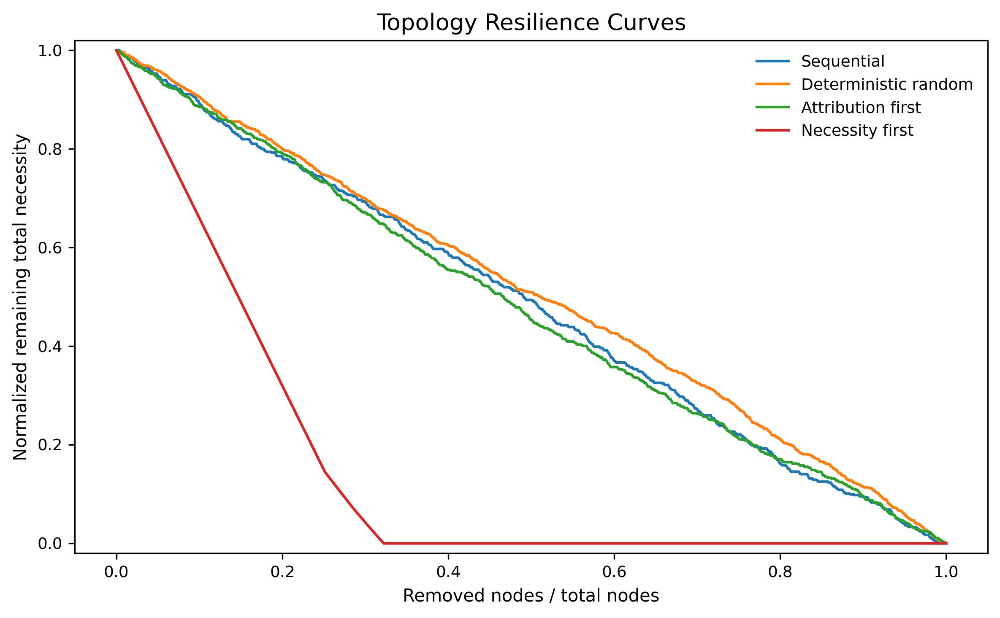

# Functional Metacognitive Attribution: A Diagnostic Framework with Reproducibility Constraints for Reflection Utility Evaluation

## Abstract

Reflective language agents use self-evaluation, error diagnosis, uncertainty monitoring, and plan revision to improve reasoning traces. These operations are natural candidates for process supervision, but a local signal that appears useful in one trace does not necessarily mark a step as structurally necessary. This paper consolidates Functional Metacognitive Attribution (FMA) as a reflection utility learning framework over observable traces. FMA estimates intervention-sensitive local utility for reflective spans, then asks whether those spans remain important under graph-based structural diagnostics. The current evidence is diagnostic rather than downstream-validating. Across 800 synthetic trajectories and 2400 reflective steps, local attribution signals are widespread, while measured structural necessity is sparse and zero-inflated. Phase 6 diagnostics show weak alignment between `attribution_score` and `structural_necessity` across PRUNE, CASCADE, and BYPASS structural modes. Phase 7 reports moderate redundancy density, low distributedness, 191 sparse bottlenecks, and weak compensation ratios. Stage 2 held-out evaluation adds a low-magnitude aggregate rank signal, but generalization remains stratum-dependent. The resulting contribution is a claim-safe diagnostic: reflective reasoning exhibits widespread local utility but sparse structural necessity, so raw local utility should not be treated directly as a supervision or filtering weight without structural calibration. Real-task v3 DELETE and v3.1 REPLACE/masked-span smokes failed sparse-signal gates, showing that coarse reflection-span interventions are boundary evidence rather than scale-ready validation.

## 1. Introduction

Reflection is often treated as a simple route from better reasoning traces to better process supervision. A language model checks a calculation, notices an inconsistency, revises a plan, or critiques a previous step. If the final answer improves, the reflective step is easy to label as useful. That assumption is attractive because it suggests a direct pipeline: identify reflective operations, score them by local utility, and use the resulting values as process-supervision or filtering weights.

The current repository supports a more cautious conclusion. Reflective steps can be locally functional without being structurally necessary. A step may receive a positive local attribution score because the fixed scoring procedure associates it with improved outcome, yet it may show zero measured necessity when the surrounding reflective graph is pruned, cascaded, or bypassed. Conversely, a step with modest local attribution may occupy a topology-sensitive position. The central empirical question is therefore not only whether reflection helps, but whether locally useful reflection has sparse structural dependence.

Functional Metacognitive Attribution addresses that question as an operational framework over observable reasoning traces. Its object is not hidden cognition, latent reasoning, or generic token attribution. The unit of analysis is an explicit reflective span in a recorded trace. The framework estimates local functional utility through structure-preserving perturbation and then studies the structural behavior of the corresponding trace representation. This keeps the analysis reproducible and bounded: every measurement is tied to stored spans, graph records, deterministic perturbation rules, and predefined utility metrics.

The paper's diagnostic mainline is compact. Phase 5 estimates local attribution over 800 synthetic reflective trajectories and 2400 reflective steps. Phase 6 builds graph-structured reflective traces and evaluates topology-sensitive dependence under PRUNE, CASCADE, and BYPASS modes. Phase 7 analyzes whether weak alignment between local utility and structural necessity can be explained by redundancy, compensation, rerouting, bottlenecks, resilience, and distributedness. Stage 2 supplies a held-out consistency check rather than a new claim of broad transfer.

The resulting pattern is consistent: reflective reasoning exhibits widespread local utility but sparse structural necessity. Phase 6 reports weak Pearson alignment between local attribution and structural necessity: 0.0753 for PRUNE, 0.0523 for CASCADE, and 0.0917 for BYPASS. Structural necessity is zero-inflated, with 67.79 percent of node-level values equal to zero. Nearly half of the step population, 49.54 percent, has positive local attribution but zero measured structural necessity. Phase 7 reinforces this distinction through low compensation and low distributedness: redundancy density is 0.3842, distributedness index is 0.2976, and sparse bottlenecks account for 191 of 2400 reflective nodes.

This finding does not say that reflective attribution fails. It says that local utility and topology-sensitive necessity are different operational proxy measurements. The distinction matters for attribution-aware supervision. A naive rule such as weighting all reflective spans by normalized local utility would over-emphasize fluent but structurally inert reflection and may underweight rare bottleneck operations. A structurally calibrated signal should instead combine local utility with structural necessity, redundancy, bottleneck status, compensation, and concentration.

The real-task and downstream evidence in this repository is intentionally reported as boundary evidence. Guarded GSM8K and HotpotQA pilot artifacts do not establish scale-ready support. The v2.1 full stochastic route failed its preregistered quality and sparse-signal gates and was abandoned under its strict contract. A one-shot downstream filtering mini-validation completed valid paired comparisons, but the pooled filtering advantage was negative. These results keep the paper in diagnostic scope. They motivate structurally calibrated supervision weight as a future design constraint, not as a completed downstream result.

The contribution is therefore methodological and empirical. Methodologically, FMA provides an intervention-based functional attribution vocabulary for reflective cognition dynamics over observable traces. Empirically, the stored diagnostics show that local utility is much broader than structural necessity. The paper's claim is not that current artifacts improve process reward modeling. The claim is that process-supervision designs based on reflection utility need a structural necessity diagnostic before local utility can be treated as a credible supervision signal.

The paper makes three specific contributions. First, it states a trace-level framework in which reflective operations are evaluated as observable units rather than as hidden mental states. This makes the framework auditable: every score can be connected to an identified span, a perturbation rule, and a utility definition. Second, it separates local functional attribution from structural necessity. This separation is the main conceptual move. A reflective operation can be locally useful because it is associated with utility under a local contrast, while still being structurally replaceable when viewed inside a graph of neighboring operations. Third, it reports a negative boundary for downstream use. The current artifacts do not support a performance claim for process supervision or reflection filtering. Instead, they show why any future use of FMA as a supervision signal should pass through a structural calibration layer.

This diagnostic contribution is useful even without a positive downstream result. Many process-supervision pipelines begin by searching for intermediate steps that correlate with success. The evidence here shows why that is insufficient for reflective traces. Reflection is not only a sequence of individually useful statements. It is a structured collection of monitoring, revision, and verification operations whose local and structural roles may diverge. The paper therefore provides a testable warning: before a reflective step receives high supervision weight, it should be checked for structural necessity, redundancy, and sparse bottleneck status.

The manuscript also distinguishes between compact paper prose and repository provenance. The repository contains route decisions, readiness audits, plans, and failure reports because those artifacts are necessary for reproducible research governance. A paper does not need to narrate every run boundary. It needs to preserve the claim boundary. For that reason, the main text reports the real-task and downstream routes as concise boundary evidence: useful for interpretation, but not part of the positive diagnostic core.

## 2. Related Work

Reflection-oriented agent methods motivate the study of explicit reflective operations. Reflexion (Shinn et al., 2023) and Self-Refine (Madaan et al., 2023) evaluate whether critique, feedback, and revision improve trajectory-level task performance. Their emphasis is practical improvement through iterative self-feedback. FMA asks a narrower structural question: once reflective steps appear in a trace, how do individual reflective spans behave under deterministic attribution and structural perturbation?

This distinction changes the level of analysis. Reflection methods usually evaluate whole trajectories or iterative policies. FMA treats reflective spans as observable intervention units and separates local utility from topology-sensitive necessity. A model may generate a useful self-checking sentence without making that sentence a structural bottleneck in the trace. The paper therefore complements reflection methods rather than replacing them. It characterizes the organization of reflective trace components after they have been produced.

Process Reward Models provide a second comparison point. Process supervision, as in Lightman et al. (2023), assigns value below the final-answer level. FMA shares the step-level motivation, but it does not treat every useful intermediate step as an immediately valid supervision target. The repository's diagnostics show that local attribution and structural necessity diverge. A process reward signal that ignores that divergence may reward redundant reflection or penalize steps whose structural role is not captured by local utility alone.

The comparison also clarifies what is not claimed. The current work does not train a reward model, tune a policy, or demonstrate a downstream process-supervision gain. It proposes a diagnostic constraint for future supervision: if reflection utility is used as a candidate signal, it should be calibrated against structural necessity, redundancy, and bottleneck evidence. This is weaker than a reward-model performance claim, but it is the claim supported by the artifacts.

Counterfactual and intervention-based interpretability methods provide the broad methodological background. They use controlled perturbations to ask whether a component changes an outcome. FMA follows that general logic while avoiding a stronger identification reading. Perturbations in this paper are operational manipulations of observable trace or graph objects. They do not expose internal model computation. The framework reports measured behavior under fixed protocols and treats the resulting values as protocol-dependent evidence.

Token attribution and attention-style explanations form another contrast. Those methods often operate at token, feature, or activation level. FMA operates over explicit reflective spans, such as self-evaluation, error correction, planning, verification, and uncertainty monitoring. This unit choice is deliberate. The paper studies metacognitive operations in recorded reasoning traces, not arbitrary textual fragments. That unit of analysis makes the framework readable for process supervision while preserving a conservative interpretation.

Reproducibility and reporting work motivates the paper's treatment of repository artifacts as part of the claim boundary. Reproducibility checklists, variance-aware reporting, and experimental-reporting standards show that results depend on documented data, code, seeds, and evaluation choices (Pineau et al., 2021; Dodge et al., 2019; Bouthillier et al., 2019). FMA therefore reports prompt locks, manifest gates, failure audits, and stored outputs as reproducibility constraints rather than as background implementation details.

Benchmark design work provides a second governance anchor. GLUE and SuperGLUE helped standardize language-understanding comparison, while Dynabench, HELM, and benchmark-governance critiques emphasize coverage, scenario design, benchmark saturation, and the limits of single-score claims (Wang et al., 2018; Wang et al., 2019; Kiela et al., 2021; Liang et al., 2022; Raji et al., 2021). This paper adopts the same caution at the trace level. Local reflection utility is interpreted only relative to a task distribution, perturbation protocol, and structural diagnostic layer.

Dataset versioning, contamination, and deduplication studies motivate the real-task governance diagnostics. Hugging Face Datasets supports loading datasets at pinned revisions, and the Datasets library provides a community infrastructure for dataset sharing and provenance (Lhoest et al., 2021; Hugging Face, 2026). Deduplication and corpus-documentation work show that repeated or poorly documented data can distort language-model training and evaluation (Lee et al., 2022; Dodge et al., 2021). Recent contamination diagnostics further caution that benchmark freshness cannot be assumed from dataset names alone, especially when test material may be memorized, rephrased, or consumed across prior artifacts (Golchin and Surdeanu, 2023; Yang et al., 2023; Zhang et al., 2024). The failed real-task v3/v3.1 smoke routes are therefore reported as boundary evidence under a reproducibility contract, not as downstream validation.

## 3. Framework

The basic object is a reflective trace containing task reasoning, explicit reflective spans, and a final answer. A reflective span is an observable segment that monitors, evaluates, revises, critiques, or redirects reasoning. It is not treated as evidence for unrecorded mental states. It is a reproducible text unit with boundaries, a role label, and a position in the trace.

FMA begins with local utility. For a reflective span \(m_k\), the framework compares the evaluated utility of the intact trace with the evaluated utility after a controlled perturbation of that span. In the implemented diagnostic layers, this quantity is represented by `attribution_score`: a local functional contribution under the fixed scoring procedure. It is a useful signal because it ranks reflective spans by measured sensitivity. It is not a complete structural score.

The second concept is `structural_necessity`. Structural necessity is a topology-sensitive dependence proxy computed over graph abstractions of reflective traces. A reflective node may be removed, removed with descendants, or bypassed through available graph structure. If the graph's measured utility or necessity profile changes strongly, the node receives stronger structural necessity evidence. If removal or bypass leaves the measured structure largely intact, the node is structurally less necessary under that mode.

The framework also uses `compensation_ratio` and `distributedness_index`. Compensation ratio measures whether downstream necessity increases after a node is removed. It is a descriptive redistribution proxy, not evidence of deliberate recovery. Distributedness index summarizes whether structural influence is concentrated among a few nodes or diffused across many nodes. Together with redundancy and bottleneck metrics, these values test whether local utility is organized as a distributed compensatory structure or as a sparse structural pattern.

These quantities should be read as operational proxy measurements.

**Table 1. Operational quantities and interpretations.**

| Quantity | Interpretation |
|---|---|
| `attribution_score` | Local functional contribution under deterministic attribution scoring |
| `structural_necessity` | Topology-sensitive dependence after graph intervention |
| `compensation_ratio` | Measured downstream redistribution after removal |
| `distributedness_index` | Concentration versus diffusion of structural influence |

The framework's claim hierarchy is important. Empirical observations are stored numeric values such as correlations, zero-necessity rates, redundancy density, compensation ratios, and resilience AUCs. Structural interpretations explain how those observations relate to trace topology. Downstream process-supervision implications remain future hypotheses unless separate downstream artifacts pass their own gates. This hierarchy prevents a local diagnostic from being rewritten as a performance claim.

FMA also remains distribution-dependent. Local and aggregate scores are defined relative to a task distribution, a trace source, a segmentation rule, a perturbation rule, and an evaluator. A high value under one protocol does not imply a universal structural role. This is why the paper emphasizes the fixed synthetic benchmark and held-out Stage 2 checks rather than general statements about all reflective reasoning.

The operational scope also clarifies the role of notation. Expressions such as a utility difference before and after perturbation are shorthand for a documented manipulation followed by evaluation. They should not be read as a stronger mathematical theory of reasoning. This matters because reflective traces are produced by language models whose internal processes are not observed. FMA does not infer those processes. It studies visible products of those processes under reproducible manipulations. The advantage is precision: the framework can say exactly what was changed and what was measured, while avoiding claims about unobserved computation.

The distinction between span-level and structure-level evidence is the core reason for adding the graph layer. A span-level score can identify a locally useful self-check or revision. It cannot say whether that operation is one of many substitutable checks, whether downstream operations absorb its role, or whether it participates in a sparse bottleneck chain. The graph abstraction is not a perfect model of reasoning, but it creates a disciplined stress test for those questions. PRUNE, CASCADE, and BYPASS are therefore best understood as complementary views of topology-sensitive dependence.

Finally, the framework treats negative and weak signals as informative. A low compensation ratio is not discarded as an absence of result. It says that downstream redistribution is limited under the structural perturbation. A low distributedness index is not a failure to find a diffuse system. It says that structural influence is concentrated. A weak correlation between attribution and necessity does not invalidate either measure. It indicates that local utility and graph dependence should be reported separately.

## 4. Methodology

The methodology has three implemented diagnostic phases. Phase 5 estimates counterfactual functional attribution. Phase 6 constructs graph-level structural diagnostics. Phase 7 consolidates redundancy, compensation, bottleneck, resilience, and distributedness analysis. Earlier phases establish trace schema, taxonomy coverage, locality checks, and deterministic infrastructure, but the paper's empirical contribution is concentrated in Phases 5 through 7.

The benchmark input contains 800 synthetic traces and 2400 reflective steps. Each trace records a task identifier, task type, question, reasoning trace, reflection spans, final answer, reference answer, correctness flag, and generation metadata when available. Reflection spans are explicit observable units with taxonomy labels and step indices. This design avoids approximate text joins and lets later phases join results by stable identifiers.

Phase 5 estimates local utility through deterministic counterfactual attribution. It computes per-span necessity and ablation results across six ablation strategies: attribution-top, attribution-bottom, category-matched random, positional-first, positional-last, and random. The output includes 2400 local attribution rows and 14400 ablation rows. Phase 5 is functional rather than structural: it asks whether a reflective step is locally associated with utility under the fixed scoring procedure.

Phase 6 changes the question. It converts reflective traces into graph structures and applies three deterministic structural modes. PRUNE removes the selected node while preserving the rest of the graph. CASCADE removes the selected node and descendants, making the diagnostic sensitive to downstream propagation. BYPASS reroutes through available structure to test whether dependence remains when the selected node is skipped. These modes are graph operations over stored trace abstractions, not semantic verification procedures.

Phase 6 then compares Phase 5 local attribution with graph-level structural necessity. The comparison uses Pearson, Spearman, Kendall tau, top-k overlap, scatter summaries, zero-inflation analysis, and stratified correlations by taxonomy, step index, and source role. The goal is descriptive: determine whether local utility and topology-sensitive dependence move together. Low alignment is not treated as a failure of reflection. It is treated as evidence that local and structural signals should not be collapsed.

Phase 7 analyzes possible explanations for this mismatch. Redundancy is estimated by combining scalar-profile similarity with downstream-influence overlap. Compensation is estimated as positive downstream necessity change after a node is removed, scaled by the necessity of the removed node. Rerouting measures breadth, depth, and entropy of redistribution. Bottlenecks combine high normalized attribution, high normalized necessity, and low redundancy. Resilience curves measure remaining total necessity under different removal orders. Distributedness summarizes concentration versus diffusion.

The supervision implication follows from the methodology. A direct local-utility weight is only a starting point. The claim-safe candidate is a structurally calibrated weight that uses local utility together with structural necessity, bottleneck status, redundancy, and compensation diagnostics. The repository has not validated such a weight in a downstream process-supervision system. The method therefore supports a diagnostic design constraint: local utility should be structurally filtered before being used for supervision or reflection filtering.

This methodology also explains why the paper reports several metric families rather than a single headline score. Attribution answers a local contrast question. Necessity answers a structural dependence question. Redundancy asks whether nodes have similar profiles or overlapping downstream influence. Compensation asks whether structural mass appears elsewhere after removal. Resilience asks how quickly the graph degrades under ordered removal. Distributedness asks whether structural influence is concentrated. These measurements can disagree, and disagreement is expected when reflection contains both fluent local operations and sparse structural bottlenecks.

The interpretation protocol is therefore conservative. When a step has high attribution and high structural necessity, it is a candidate sparse bottleneck. When it has high attribution but zero structural necessity, it is locally useful but structurally inert under the graph protocol. When it has low attribution but high structural necessity, it may be a topology-sensitive support operation not captured by local utility alone. When compensation is weak, the framework should not claim broad recovery. These cases give the paper its diagnostic force: it does not merely rank reflective spans; it explains why ranking alone is insufficient.

## 5. Experiments

The completed experiments use deterministic stored artifacts. No external generation is required to reproduce the Phase 5-7 diagnostic core. The primary data scale is 800 traces and 2400 reflective steps. The taxonomy layer contains 2400 total reflections and covers BACKTRACKING, CONSTRAINT_TRACKING, DECOMPOSITION, ERROR_CORRECTION, PLANNING, RETRIEVAL, UNCERTAINTY_MONITORING, and VERIFICATION without collapse warnings.

The Phase 6 graph representation contains 800 graphs, 2400 nodes, and 2098 edges. This graph layer is the basis for structural node necessity, edge necessity, subgraph necessity, and alignment diagnostics. The main empirical comparison is between the Phase 5 `attribution_score` and Phase 6 `structural_necessity` across PRUNE, CASCADE, and BYPASS modes.

The experimental design separates three evidence layers. The first layer is completed diagnostic evidence from Phases 5-7. It supports the main paper claim that local utility and structural necessity diverge. The second layer is guarded real-task pilot evidence. It is useful for boundary analysis but does not replace the deterministic synthetic core. The third layer is downstream filtering evidence. The current mini-validation is negative, so it blocks performance claims rather than supporting them.

Stage 2 is a held-out consistency check over stored artifacts. It evaluates a common step-level comparison space where the prediction target is step-level utility difference and each method supplies a step-level score vector. FMA is already a step-level representation, so the projection audit uses identity mappings for FMA. This should be read as a representation audit rather than as evidence of nontrivial token-to-step projection robustness.

The required baseline families are random masking, span masking, graph removal, and edge dropout. In the current artifact set they are integrated as conservative, leakage-clean proxy controls. This closes the missing-baseline reporting gap for the diagnostic paper, but it does not create a broad superiority result. The baseline rows should be described as clean conservative controls in the same step-level comparison space.

The figure set is similarly diagnostic. The main figures show the relation between local attribution and structural necessity, structural-mode summaries, redundancy density, weak compensation, and resilience curves. Supplementary candidates can report taxonomy distributions, graph-size distributions, bottleneck examples, distributedness distributions, and structural influence distributions. Captions describe measured outputs and perturbation settings, not internal mechanisms.

The experiments are also designed to keep method comparison in a common space. Raw token-level, attention-level, or activation-level quantities are not primary results unless they are projected into step-level scores. This prevents a misleading comparison between unlike objects. FMA is evaluated as a step-level score vector because its unit of analysis is a reflective span. Baseline rows are therefore interpreted as step-level proxy controls, not as full alternative systems.

The Stage 2 split is used for consistency rather than escalation. The full held-out set can show whether the diagnostic relation survives a frozen split, but the claim gate also requires attention to strata. This is why the paper reports both the aggregate effect and the heterogeneous stratum outcome. A small aggregate signal with mixed strata is still useful evidence for a diagnostic relation, but it is not a warrant for broad transfer language.

## 6. Results

The main result is the divergence between local attribution and structural necessity. Across 2400 reflective nodes, Phase 6 reports weak Pearson alignment between `attribution_score` and `structural_necessity`: 0.0753 for PRUNE, 0.0523 for CASCADE, and 0.0917 for BYPASS. Spearman alignment is also weak: 0.0596 for PRUNE, 0.0512 for CASCADE, and 0.0623 for BYPASS. These values indicate that the two signals carry different information under the implemented protocol.

**Figure 1. Local attribution versus topology-sensitive structural necessity.** Stored Phase 6 diagnostics compare `attribution_score` with `structural_necessity` under PRUNE, CASCADE, and BYPASS graph perturbation modes.

**Table 2. Core diagnostic results.**

| Diagnostic quantity | Stored value | Interpretation |
|---|---:|---|
| Phase 6 Pearson alignment | PRUNE 0.0753; CASCADE 0.0523; BYPASS 0.0917 | Weak alignment between local utility and structural necessity |
| Zero structural necessity | 67.79 percent | Sparse topology-sensitive dependence |
| Positive attribution with zero necessity | 49.54 percent | Local utility is broader than structural necessity |
| Stage 2 held-out relation | Spearman 0.1628; 95 percent CI [0.0916, 0.2347] | Low-magnitude, stratum-dependent support |
| Redundancy density | 0.3842 | Moderate redundancy |
| Distributedness index | 0.2976 | Concentrated structural influence |
| Sparse bottlenecks | 191 of 2400 nodes | Rare structurally necessary candidates |
| Mean compensation ratio | PRUNE 0.0084; CASCADE 0.0000; BYPASS 0.0152 | Weak compensation |

Structural necessity is sparse. In every structural mode, 67.79 percent of node-level structural necessity values are zero. Only 18.25 percent of samples have both zero attribution and zero structural necessity. The more revealing group is the positive-attribution and zero-necessity population: 49.54 percent of steps have positive local attribution but zero measured structural necessity. This is the clearest evidence for the paper's diagnostic claim. Many reflective steps are locally functional in the attribution layer but structurally inert in the graph layer.

**Figure 2. Structural diagnostic summary by perturbation mode.** Stored Phase 6 summaries report alignment, overlap, and zero-inflation diagnostics across PRUNE, CASCADE, and BYPASS modes.

This result is not a contradiction. It means that local utility and topology-sensitive dependence answer different questions. Local utility asks whether a reflective span contributes under a local scoring contrast. Structural necessity asks whether graph-level dependence remains after removal, propagation-sensitive removal, or bypass. A step can answer the first question positively and the second negatively if neighboring structure absorbs its role or if the graph abstraction does not depend on that node.

Stage 2 adds a low-magnitude held-out signal. Across 280 held-out traces and 840 held-out steps, FMA has Spearman rho 0.1628 with a 95 percent bootstrap interval of [0.0916, 0.2347]. The interval excludes zero on the full held-out set, but the effect-size label is small. The stratum audit is heterogeneous. Some strata pass the confidence-interval gate, while others include zero. The correct summary is stratum-dependent support, not uniform support across all required strata.

The baseline gate is clean but conservative. The required rows for random masking, span masking, graph removal, and edge dropout use frozen non-target proxy rules and avoid direct target leakage. Each row has held-out step scores in the common comparison space. These controls are sufficient for claim-safe diagnostic reporting, but they do not establish that FMA is broadly superior to independently rerun perturbation-response baselines.

Phase 7 explains the mismatch through limited structural redistribution. Redundancy density is moderate at 0.3842, with mean redundancy cluster size 1.1310 and cluster density 0.0983. This indicates some substitutable structural profiles, but not a broadly diffuse reflective graph. Mean compensation ratios are near zero: 0.0084 for PRUNE, 0.0000 for CASCADE, and 0.0152 for BYPASS. Median compensation is also zero in the reported distributions. Rerouting entropy is 0.0000, and mean rerouting depth is 0.0100.

**Figure 3. Redundancy density distribution.** Stored Phase 7 redundancy diagnostics report the distribution of redundancy density values over reflective graph records.

**Figure 4. Weak compensation distribution.** Stored Phase 7 compensation diagnostics show near-zero compensation ratios after structural perturbations, with distributions reported by mode.

Sparse bottlenecks provide the positive structural counterpart. The bottleneck analysis identifies 191 bottlenecks among 2400 nodes, a frequency of 0.0796. These nodes combine high normalized attribution, high normalized necessity, and low redundancy degree. Their rarity is consistent with the overall pattern: many reflective steps are locally useful, but only a smaller subset is structurally necessary under the operational graph protocol.

Distributedness is low. The global distributedness index is 0.2976, indicating concentration rather than broad diffusion of structural influence. Resilience curves reinforce that conclusion. Necessity-first removal has AUC 0.1488, far below sequential removal at 0.4840, deterministic random removal at 0.5098, and attribution-first removal at 0.4761. Removing structurally necessary nodes degrades the remaining structure much more sharply than removing high-attribution nodes alone.

**Figure 5. Resilience curves under ordered removal.** Stored Phase 7 resilience diagnostics compare necessity-first, attribution-first, sequential, and deterministic random removal orders over the same graph records.

The final empirical interpretation is a hypothesis refinement. The initial expectation was that reflection might exhibit distributed compensatory organization. The observed evidence shows weaker compensation and lower distributedness than that hypothesis expected. That is not an experimental failure. It is the result: reflective reasoning in this benchmark has widespread local utility, sparse structural necessity, limited redistribution, and rare bottleneck structure.

The most important practical consequence is that local utility is over-inclusive. If every positive local attribution score were treated as a supervision weight, nearly half of all reflective steps would receive weight despite having zero measured structural necessity under the reported graph modes. This does not mean those steps are useless. It means that their supervision value is ambiguous without structural context. Some may be redundant checks, some may be surface-level reflections, and some may help locally while being unnecessary to the surrounding graph.

The bottleneck result provides the complementary under-inclusive risk. A small set of nodes combines high local attribution, high structural necessity, and low redundancy. These are the steps most plausibly aligned with the paper's notion of structural necessity. A supervision design that relies only on local attribution may not distinguish these sparse bottlenecks from a much larger population of locally positive but structurally inert spans. This is why the paper argues for calibration rather than direct weighting.

The resilience curves make the same point through degradation behavior. Necessity-first removal degrades the graph sharply, while attribution-first removal is much closer to sequential and deterministic random removal. If attribution were a sufficient substitute for structural necessity, attribution-first removal would be expected to resemble necessity-first removal more closely. The observed gap is another sign that the two rankings should remain distinct.

## 7. Boundary Evidence and Governance Diagnostics

Boundary evidence prevents the diagnostic result from being overstated. The completed empirical core remains Phase 5-7, where stored synthetic traces support the distinction between local utility and sparse structural necessity. Real-task and downstream routes are reported only as boundary evidence because they either remain blocked or failed preregistered gates. This section therefore treats failed routes as reproducibility diagnostics rather than as attempted upgrades to the main claim.

### 7.1 Boundary Evidence from Failed Routes

The v2.1 route illustrates the claim boundary. It produced a recomputed pilot stochastic artifact that passed pilot gates only. The later full stochastic validation failed its preregistered quality and sparse-signal gates: exact JSON/schema/tag/final-answer success fell below the required value because of timeout and connection failures, and GSM8K nonzero Delta-U remained below threshold. A strict engineering retry did not rescue the route, so strict v2.1 full validation was abandoned under its current contract.

The downstream filtering mini-validation is also negative boundary evidence. It used paired pilot-sourced comparisons and completed 20/20 valid pairs, but it failed its filtering-signal gate. The pooled mean advantage for masking the lower-scored span rather than the higher-scored anti-filter was -0.05, with GSM8K at -0.2 and HotpotQA at 0.1. This is not preliminary downstream support. It is evidence that the current pilot-sourced signal should not be converted into a PRM/filtering claim.

### 7.2 Real-Task v3/v3.1 Sparse-Signal Boundary

The real-task v3 DELETE smoke executed under a guarded smoke-only scope and failed sparse-signal gates. Transport, trace count, and eligible-span gates passed, but nonzero Delta-U remained at 1 for GSM8K against the threshold of 25 and 28 for HotpotQA against the threshold of 35. The route remains `PILOT_BLOCKED`, and DELETE rows are failure provenance only.

The v3.1 REPLACE/masked-span smoke also executed under a guarded smoke-only scope and failed the same sparse-signal standard. It reached 196 valid traces, 588 eligible spans, and transport success of 0.9979633401221996, but GSM8K nonzero Delta-U was 8 against 25 and HotpotQA nonzero Delta-U was 14 against 35. A companion consistency audit records that the raw report uses `intervention_type=REPLACE` while reporting `intervention_implementation=length_preserving_masked_delete`, names only GSM8K in the raw status despite the HotpotQA gate also failing, and repeats a stale preregistration next-step field. The audited next step is to stop further intervention tuning under the current preregistration.

Together, the v3 and v3.1 smokes are negative boundary evidence. They show that coarse reflection-span deletion or masked replacement does not create sufficient outcome variation on GSM8K and HotpotQA with the current model and protocol. They do not support locked validation, downstream filtering, or claim upgrade.

**Table 3. Boundary evidence and governance status.**

| Route or diagnostic | Stored status | Claim role |
|---|---|---|
| Phase 5-7 synthetic diagnostics | Completed stored evidence over 800 traces and 2400 reflective steps | Primary empirical core |
| v2.1 full stochastic validation | Failed preregistered quality and sparse-signal gates; strict retry did not rescue the route | Failed full-scale boundary evidence |
| v2.1 downstream filtering mini-validation | 20/20 valid pairs but negative pooled filtering advantage (-0.05) | Negative downstream boundary check |
| Real-task v3 DELETE smoke | Failed sparse-signal gates: GSM8K 1/25 and HotpotQA 28/35 | Negative real-task boundary evidence |
| Real-task v3.1 REPLACE/masked-span smoke | Failed sparse-signal gates: GSM8K 8/25 and HotpotQA 14/35; companion audit records report inconsistencies | Negative real-task boundary evidence |
| Future PRM/filtering validation | Not completed in current artifacts | Future application hypothesis |

### 7.3 Implications for Process Supervision Benchmarks

These boundary results sharpen the benchmark requirement. A process supervision benchmark cannot rely only on local reflection utility, and it also cannot assume that coarse span deletion or masked replacement will produce an informative real-task signal. It needs structural calibration, explicit intervention contracts, dual-task gate reporting, frozen scoring rules, and companion audits when report fields conflict with preregistered contracts.

The diagnostic contribution is therefore two-sided. Phase 5-7 show why local utility should be separated from structural necessity. The failed real-task and downstream routes show why reflection utility evaluation must preserve negative evidence rather than converting failed gates into validation claims. Future validation should define fresh data, frozen scoring rules, structural calibration, repeated replay or equivalent uncertainty reporting where needed, baseline fairness checks, and downstream metrics before evaluation. Until such evidence exists, the current manuscript should close at diagnostic support and negative boundary evidence, not downstream process-supervision validation.

## 8. Limitations

The first limitation is the operational nature of the measurements. The local attribution, structural necessity, compensation, and distributedness quantities are protocol-dependent proxies. They summarize how stored traces and graph abstractions behave under deterministic perturbation rules. They do not expose hidden reasoning, semantic understanding, internal mechanisms, or universal structural roles.

The second limitation is the synthetic benchmark. The deterministic 800-trace benchmark improves reproducibility, but it does not guarantee external validity on open-ended reasoning tasks, deployed agent traces, human-authored rationales, or other models. The held-out Stage 2 audit supports only a small aggregate signal with heterogeneous strata. Larger and more varied trace collections are required before the pattern can be treated as robust across settings.

The third limitation is segmentation dependence. Reflection spans are observable units with fixed boundaries, but span extraction is an operational choice. Different segmentation rules could merge, split, or exclude reflective operations. Any future extension should report span-boundary rules and test sensitivity to segmentation. The current paper keeps this limitation visible by treating reflective spans as analysis units, not theoretical primitives.

The fourth limitation is graph approximation. PRUNE, CASCADE, and BYPASS are deterministic graph interventions over stored trace topology. They are useful structural diagnostics, but they do not prove semantic dependence. Edges and downstream structures are abstractions that help compare local attribution with topology-sensitive dependence. Their value is reproducibility and diagnostic clarity, not mechanism recovery.

The fifth limitation concerns downstream evidence. The current mini filtering validation failed, and no PRM training or full downstream comparison has passed. Structurally calibrated FMA can be discussed as a candidate design constraint, but not as a completed process-supervision method. A future downstream validation would need explicit comparisons against vanilla PRM, length-calibrated PRM, token-attribution baselines, heuristic reflection scoring, and frozen reflection-weight baselines.

Finally, the reference layer is intentionally compact. The manuscript uses established anchors for reflection methods, self-refinement, and process supervision, but a venue-format bibliography pass remains a separate formatting task. Citation safety is preferable to adding unverified bibliographic detail.

## 9. Reproducibility

The empirical core is reproducible from stored repository artifacts. Phase 5, Phase 6, and Phase 7 use local traces, deterministic runners, JSON/JSONL reports, and generated figures. They do not require new external generation. This distinction matters because the paper's positive claim rests on stored deterministic diagnostics, while real-task and downstream routes are reported only as bounded evidence.

The core reproduction sequence is straightforward. Run the test suite, regenerate structural diagnostics, regenerate redundancy and compensation analysis, and optionally regenerate counterfactual attribution. The expected outputs include local attribution scores, counterfactual ablation rows, structural graph files, node/edge/subgraph necessity rows, structural diagnostic summaries, redundancy analysis, compensation figures, redundancy-density figures, bottleneck examples, resilience curves, and distributedness distributions.

Reproducibility also depends on claim discipline. Empirical observations should be read from stored output files. Structural interpretations should explain those observations without converting them into stronger assertions. Route documents, readiness audits, and claim registries should remain evidence boundaries, not main-text chronological logs. This manuscript follows that rule by compressing audit state into short boundary prose.

## 10. Conclusion

This paper consolidates FMA as a diagnostic framework for reflective trace structure. The motivating application is attribution-aware process supervision, but the completed evidence answers a prerequisite question: do reflective reasoning steps that appear locally functional also show structural necessity? In the current repository, the answer is mixed in a useful way. Reflective reasoning exhibits widespread local utility but sparse structural necessity.

Phase 5 shows that many reflective steps receive local attribution signals. Phase 6 shows that those signals align weakly with topology-sensitive structural necessity and that necessity is zero-inflated. Phase 7 refines the initial distributed-compensation hypothesis by reporting moderate redundancy, weak compensation, low distributedness, and sparse bottlenecks. Stage 2 adds a low-magnitude, stratum-dependent held-out relation.

The implication for supervision is direct but bounded. Raw local utility should not be used directly as a process-supervision or filtering weight. A structurally calibrated signal should account for structural necessity, bottleneck status, redundancy, and compensation. The current repository does not prove that such a signal improves downstream behavior. The mini filtering check is negative, and the v3/v3.1 real-task smokes failed sparse-signal gates. The defensible contribution is diagnostic: it identifies why local reflection utility needs structural calibration before it can support reliable attribution-aware supervision.

## References

Noah Shinn, Federico Cassano, Ashwin Gopinath, Karthik Narasimhan, and Shunyu Yao. 2023. "Reflexion: Language Agents with Verbal Reinforcement Learning." *Advances in Neural Information Processing Systems 36 (NeurIPS 2023)*.

Aman Madaan, Niket Tandon, Prakhar Gupta, Skyler Hallinan, Luyu Gao, Sarah Wiegreffe, Uri Alon, Nouha Dziri, Shrimai Prabhumoye, Yiming Yang, Shashank Gupta, Bodhisattwa Prasad Majumder, Katherine Hermann, Sean Welleck, Amir Yazdanbakhsh, and Peter Clark. 2023. "Self-Refine: Iterative Refinement with Self-Feedback." *Advances in Neural Information Processing Systems 36 (NeurIPS 2023)*.

Hunter Lightman, Vineet Kosaraju, Yura Burda, Harri Edwards, Bowen Baker, Teddy Lee, Jan Leike, John Schulman, Ilya Sutskever, and Karl Cobbe. 2023. "Let's Verify Step by Step." arXiv:2305.20050. https://doi.org/10.48550/arXiv.2305.20050.

Joelle Pineau, Philippe Vincent-Lamarre, Koustuv Sinha, Vincent Lariviere, Alina Beygelzimer, Florence d'Alche-Buc, Emily Fox, and Hugo Larochelle. 2021. "Improving Reproducibility in Machine Learning Research: A Report from the NeurIPS 2019 Reproducibility Program." *Journal of Machine Learning Research* 22(164):1-20.

Jesse Dodge, Suchin Gururangan, Dallas Card, Roy Schwartz, and Noah A. Smith. 2019. "Show Your Work: Improved Reporting of Experimental Results." *Proceedings of EMNLP-IJCNLP 2019*, 2185-2194.

Xavier Bouthillier, Cesar Laurent, and Pascal Vincent. 2019. "Unreproducible Research is Reproducible." *Proceedings of the 36th International Conference on Machine Learning*, PMLR 97:725-734.

Alex Wang, Amanpreet Singh, Julian Michael, Felix Hill, Omer Levy, and Samuel R. Bowman. 2018. "GLUE: A Multi-Task Benchmark and Analysis Platform for Natural Language Understanding." *Proceedings of the 2018 EMNLP Workshop BlackboxNLP*, 353-355.

Alex Wang, Yada Pruksachatkun, Nikita Nangia, Amanpreet Singh, Julian Michael, Felix Hill, Omer Levy, and Samuel R. Bowman. 2019. "SuperGLUE: A Stickier Benchmark for General-Purpose Language Understanding Systems." *Advances in Neural Information Processing Systems 32*.

Douwe Kiela, Max Bartolo, Yixin Nie, Divyansh Kaushik, Atticus Geiger, Zhengxuan Wu, Bertie Vidgen, Grusha Prasad, Amanpreet Singh, Pratik Ringshia, Zhiyi Ma, Tristan Thrush, Sebastian Riedel, Zeerak Waseem, Pontus Stenetorp, Robin Jia, Mohit Bansal, Christopher Potts, and Adina Williams. 2021. "Dynabench: Rethinking Benchmarking in NLP." *Proceedings of NAACL-HLT 2021*, 4110-4124.

Percy Liang, Rishi Bommasani, Tony Lee, Dimitris Tsipras, Dilara Soylu, Michihiro Yasunaga, Yian Zhang, and coauthors. 2022. "Holistic Evaluation of Language Models." arXiv:2211.09110. https://doi.org/10.48550/arXiv.2211.09110.

Inioluwa Deborah Raji, Emily M. Bender, Amandalynne Paullada, Emily Denton, and Alex Hanna. 2021. "AI and the Everything in the Whole Wide World Benchmark." *NeurIPS Datasets and Benchmarks*.

Quentin Lhoest, Albert Villanova del Moral, Yacine Jernite, Abhishek Thakur, Patrick von Platen, Suraj Patil, Julien Chaumond, Mariama Drame, Julien Plu, Lewis Tunstall, Joe Davison, Mario Sasko, Gunjan Chhablani, Bhavitvya Malik, Simon Brandeis, Teven Le Scao, Victor Sanh, Canwen Xu, Nicolas Patry, Angelina McMillan-Major, Philipp Schmid, Sylvain Gugger, Clement Delangue, Theo Matussiere, Lysandre Debut, Stas Bekman, Pierric Cistac, Thibault Goehringer, Victor Mustar, Francois Lagunas, Alexander M. Rush, and Thomas Wolf. 2021. "Datasets: A Community Library for Natural Language Processing." *Proceedings of EMNLP 2021: System Demonstrations*, 175-184.

Hugging Face. 2026. "Datasets Documentation: Load a Dataset with a Specific Revision." Accessed June 6, 2026. https://huggingface.co/docs/datasets/v3.4.0/en/loading.

Katherine Lee, Daphne Ippolito, Andrew Nystrom, Chiyuan Zhang, Douglas Eck, Chris Callison-Burch, and Nicholas Carlini. 2022. "Deduplicating Training Data Makes Language Models Better." *Proceedings of ACL 2022*, 8424-8445.

Jesse Dodge, Maarten Sap, Ana Marasovic, William Agnew, Gabriel Ilharco, Dirk Groeneveld, Margaret Mitchell, and Matt Gardner. 2021. "Documenting Large Webtext Corpora: A Case Study on the Colossal Clean Crawled Corpus." *Proceedings of EMNLP 2021*, 1286-1305.

Shahriar Golchin and Mihai Surdeanu. 2023. "Data Contamination Quiz: A Tool to Detect and Estimate Contamination in Large Language Models." arXiv:2311.06233. https://doi.org/10.48550/arXiv.2311.06233.

Shuo Yang, Wei-Lin Chiang, Lianmin Zheng, Joseph E. Gonzalez, and Ion Stoica. 2023. "Rethinking Benchmark and Contamination for Language Models with Rephrased Samples." arXiv:2311.04850. https://doi.org/10.48550/arXiv.2311.04850.

Hugh Zhang, Jeff Da, Dean Lee, Vaughn Robinson, Catherine Wu, Will Song, Tiffany Zhao, Pranav Raja, Charlotte Zhuang, Dylan Slack, Qin Lyu, Sean Hendryx, Russell Kaplan, Michele Lunati, and Summer Yue. 2024. "A Careful Examination of Large Language Model Performance on Grade School Arithmetic." arXiv:2405.00332. https://doi.org/10.48550/arXiv.2405.00332.
